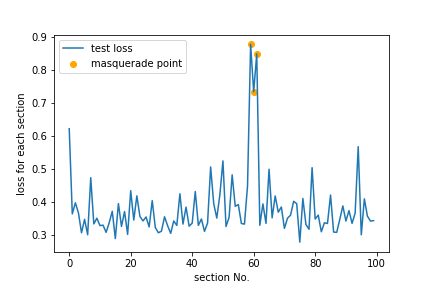

# Description
This is the anomaly detection of code based on deep neural networks.

The basic model is Variational autoencoder (VAE). 


# Requirements
- Python 3.7.12
- pytorch 1.10.0
- fasttext 0.9.2

# Installation
```bash
$ pip install fasttext
```

# Usage
 
## train the VAE for anomaly detection
 
```bash
$ git clone git@github.com:Reo-I/anomaly-detection.git
$ cd anomaly-detection
$ python ad_vae_trainer.py 
```

# Dataset
Import the Masquerading User Data (http://schonlau.net/). Please read the detail of datasets.   
Preprocess the training data accoding to the following command. 
```bash
for f in masquerade-data/*;do head -n 5000 $f|perl -pe 's/\n/ /g'|perl -pe 's/$/\n/'>> train.txt; done
```

# Results


 # Licence

[MIT](https://github.com/tcnksm/tool/blob/master/LICENCE)

# Author
* [Reo-I](https://github.com/Reo-I) (Graduate School of Frontier Science, Univeristy of Tokyo)

